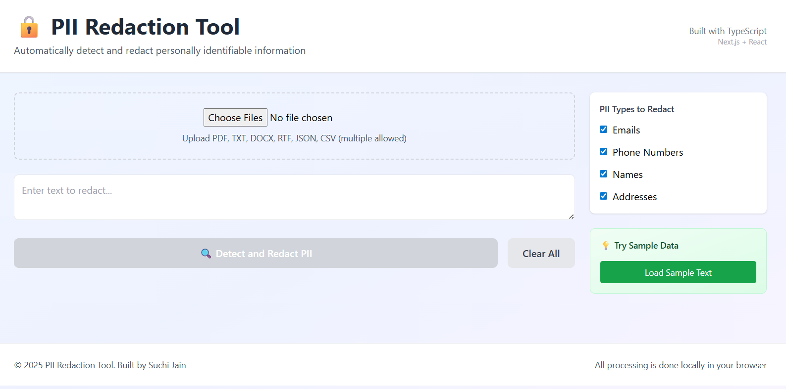
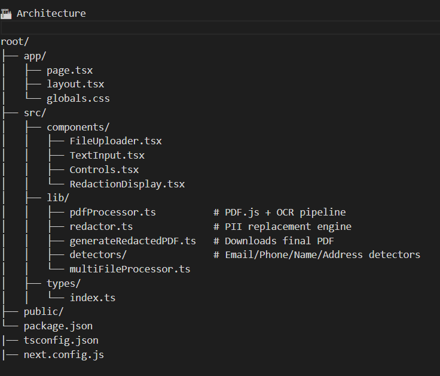

🔒 PII Redaction Tool
A privacy-first document redaction system for PDFs, scanned documents, and text files — built with Next.js, TypeScript, OCR, and custom PII detection.
📌 Overview

The PII Redaction Tool is a browser-based application that automatically extracts text from documents, detects sensitive information, and redacts it safely. All processing happens entirely on the client-side, ensuring that no personal data ever leaves the user’s device.

This tool supports both digital PDFs and scanned PDFs (via OCR), as well as TXT and DOCX files. Users can preview redactions and download a clean, redacted PDF.

✨ Features

🔍 PII Detection
Detects:

Emails
Phone numbers
Names
Addresses

🧠 Smart Redaction Engine
Replaces detected entities with consistent tokens:

[EMAIL_1], [NAME_1], [ADDRESS_2], [PHONE_3]

📄 Document Support

Digital PDFs (PDF.js)
Scanned PDFs (Tesseract OCR)
TXT files
DOCX files

🚀 Client-side Only (100% Private)
No server, no backend API, no data sent to cloud.

📥 Multiple File Support
Upload many documents at once — text gets merged automatically.

🖨 Download Redacted PDF
Generates a redacted PDF ready for safe sharing.

⚡ Hybrid Text Extraction Pipeline

Fast parsing for digital PDFs

Automatic fallback to OCR for scanned PDFs

🖼 Screenshots
🔧 Application UI

(Replace with your actual screenshots)

📝 Redaction Preview

🏗 Architecture

root/
├── app/
│   ├── page.tsx
│   ├── layout.tsx
│   └── globals.css
├── src/
│   ├── components/
│   │   ├── FileUploader.tsx
│   │   ├── TextInput.tsx
│   │   ├── Controls.tsx
│   │   └── RedactionDisplay.tsx
│   ├── lib/
│   │   ├── pdfProcessor.ts          # PDF.js + OCR pipeline
│   │   ├── redactor.ts              # PII replacement engine
│   │   ├── generateRedactedPDF.ts   # Downloads final PDF
│   │   ├── detectors/               # Email/Phone/Name/Address detectors
│   │   └── multiFileProcessor.ts
│   ├── types/
│   │   └── index.ts
├── public/
└── package.json
|── tsconfig.json
|── next.config.js

🧠 Why This Approach?
1️⃣ 100% Privacy by Design

Since PII is sensitive, all extraction and redaction is performed locally in the browser.
No backend = no data leaks.

2️⃣ Works for All Types of PDFs

PDF.js extracts embedded text quickly

Tesseract.js OCR handles scanned or image-based PDFs

This hybrid pipeline ensures reliability.

3️⃣ Modular PII Detection

Each PII category has its own detector module
→ Easy to extend and maintain.

4️⃣ Token-Based Redaction

Instead of black bars (which can fail during PDF generation),
redactions use safe text tokens that cannot be recovered.

⚠️ Assumptions & Limitations

OCR (for scanned PDFs) may introduce minor text inaccuracies.

Name detection is regex-based, not ML-based → may miss rare name formats.

Processing time increases for large PDFs (20+ pages with OCR).

PDF export cannot embed heavy Unicode (█), so tokens are used instead.

Browser performance varies by device.

🔧 Trade-offs

| Decision                  | Benefit                        | Trade-off                       |
| ------------------------- | ------------------------------ | ------------------------------- |
| Browser-only execution    | Maximum privacy                | OCR is slower than cloud APIs   |
| Regex-based PII detection | Fast, simple, explainable      | Less accurate than ML           |
| Token redaction           | Unrecoverable, safe PDF output | No visual blackout in final PDF |
| Hybrid OCR pipeline       | Works for all PDFs             | Complex implementation          |

🧪 ML-based PII detection (names & addresses via ONNX models)

⚙️ Parallel OCR (5–6 workers) for massive performance boost

📊 Progress UI (“Processing page 5 of 23…”)

🧹 Text cleanup to fix OCR artifacts

🗃 Support for Aadhaar, PAN, SSN, Passport, etc.

📦 Export redacted DOCX & TXT formats

📄 Draw black-redaction rectangles directly on PDF canvas

🛠 Installation
git clone https://github.com/suchijain30/pii-redaction-tool
cd pii-redaction-tool
npm install
npm run dev

Open in browser:
👉 http://localhost:3000

🌐 Deployment

The project is deployed via Vercel using Next.js App Router.
Easily scalable & serverless by default.

https://pii-redaction-tool-git-main-suchijain30s-projects.vercel.app

👩‍💻 Author

Suchi Jain
Software Engineer & Automation Specialist
Passionate about document intelligence, privacy, and scalable automation.